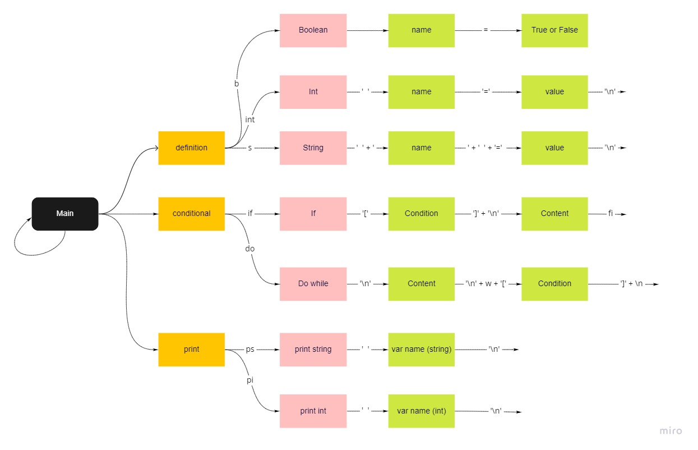

# Trabajo práctico especial LTM

## Datos de la materia
72.39 Autómatas, Teoría de Lenguajes y Compiladores
Comisión S

## Información del grupo
### Nombre 
 Los Tres Mosqueteros

### Integrantes
*   Ana Cruz, legajo 60476
*   Salustiano Zavalía Pángaro, legajo 60312
*   Valentino Riera Torraca, legajo 60212

---
---
## Tabla de contenidos
1.  Antes de empezar
1.  Como correr nuestro compilador
1.  Sobre el lenguaje
1.  La gramática
1.  Complicaciones encontradas
1.  Futuras mejoras
1.  Referencias

---
## Antes de empezar... 
*   Requisitos:
    *   tener instalado gcc, bison y flex
    * tener clonado el repositorio de git del grupo. 

## Como correr nuestro compilador
Dentro de la carpeta compiler hay un archivo  `makefile`. Este se encarga de "instalar" el proyecto y de compilarlo, para facilitar el uso. 
Para tener todo listo para empezar, habria que hacer: 

    $ make install
    $ make all
    
Lo cual generará un archivo compiler.out. 

Ahora podemos usar este compilador pasandole un archivo previamente escrito o programar por linea de comandos, usando ctrl + D como caracter de cierre. Las ejecuciones respectivas son:

    $ cat miArchivo.ltm | ./compiler.out
    $ ./compiler.out

Esto me va a generar un archivo `output-out.c`. Compilamos este archivo como habitualmente con GCC y corremos el ejecutable generado:

    $ gcc output/out.c
    $ ./output/a.out

---
# Sobre el lenguaje

## Introducción
No fue tarea sencilla pensar el lenguaje que ibamos a querer generar para este trabajo practico. Teniamos en claro que queríamos algo útil, con algún uso de caso real que nos pareciera relevante. Tambien queriamos algo que no fuera excesivamente rebuscado, ya que el objetivo no era hacer un lenguaje increiblemente innovador, si no que queríamos aplicar los temas vistos en la materia. Estabamos pensando que queríamos hacer una minimizacion de C, que requiera menos clicks para generar el mismo codigo. 

Fue así como llegamos a la idea de "LTM", un lenguaje que se plantea como objetivo solo usar caracteres que no necesiten de un segundo click para ser activadas (como sería poner un parentesis, que tendríamos que apretar shift + 8). Nos pareció que este lenguaje podría serle de utilidad a gente con alguna discapacidad que solamente le permita tener una mano en el teclado, o todavia mas restrictivo, que use un mouth stick para escribir, lo que dificultaría mucho usar C tradicional.

Para esto, nos basamos en el teclado [United States](https://upload.wikimedia.org/wikipedia/commons/5/51/KB_United_States-NoAltGr.svg) como figura en el link. 

En resumen, el objetivo de nuestro lenguaje es hacer un lenguaje basico, accesible y facil de aprender. De esta manera, esperamos poder disponibilizar la ideas iniciales de la programación a mas gente. 

# Desarrollo del trabajo
Como fue previamente mencionado en la introducción, invertimos una buena cantidad de tiempo en pensar una idea para el lenguaje que nos convenciera y nos motivara. Una vez que nos decidimos, usamos todavía mas tiempo para pensar y definir la gramática correctamente, primero haciendo un grafo tentativo de como queríamos que corriera la gramatica.

Por razones obvias no se ilustran las recursividades, y todos los nodos Content pueden internamente tener la logica que parte del nodo main. Ademas, las flechas que no van a ningun lado al final representarían un regreso al main para empezar denuevo con una nueva linea. 

Luego de armar esto, definimos la gramatica `BNF`. Este archivo tambien esta disponible en la raíz del repositorio para poder ser revisado. 

Luego, nos dividimos el trabajo: por un lado escribiamos la definición de la gramática en yacc y el lexer correspondiente y por otro arrancamos con la estructura del compilador en C. Al no ser la primera vez que los tres integrantes trabajamos juntos, ya conocemos nuestras fortalezas y debilidades y no fue dificil realizar esta división de la manera más eficiente para nosotros. 

## Lógica del compilador
En la primera instancia, el compilador arma un AST donde cada nodo representa una sentencia. Todos los tipos de nodos están detallados en el archivo node_t.h. Algunos de éstos son: definición de una variable, asignación de una variable, comparación de 2 sentencias, expresiones aritméticas, etc. 

Lo que logramos con esto es tener toda la estructura del programa lista para ser convertida en código C usando la lógica detallada en el archivo reduce_node.c. Aquí ensamblamos un código de C equivalente al código de entrada, que luego se guarda en un archivo. Esto simplifica notablemente la lógica en el parser.y, y nos permite modularizar mejor el código.

---

# La gramática 
El lenguaje "LTM" tiene muchas semejanzas con C. En esta sección iremos listando como se usan las funciones disponibles. 

Es importante notar que para disminuir la cantidad de teclas que hay que presionar se omitió el uso de `;` y en cambio se separan las operaciones con enters.
Tambien usamos llaves cuadradas en lugar de paréntesis para marcar parametros o indicar precedencia en las operaciones aritméticas.

Adicionalmente y para simplificar todavía mas el uso, el lenguaje no necesita de una función main. El programa directamente se empieza a escribir desde la primera linea. 

---

## Variables
*   Para declarar una variable numérica se usa el identificador `num`. Este siempre representa un double. Una definición modelo de una variable sería así:

        num varNumerica = 4

    El lenguaje también permite declarar variables sin inicializarlas, en cuyo caso agregaría el enter despues del nombre.

*   Para declarar una variable de tipo string, o su equivalente en c, vector de chars, uso el identificador `s`. Por ejemplo:

        s varTextual = 'Un string de prueba'
    Como para usar comillas dobles deberíamos apretar la tecla `shift`, se optó por usar las comillas simples y no permitir la definicion de variables tipo chars, que serían las que en C deberían ir entre comillas simples. 

*   Para declarar una variable booleana usamos el identificador `b`. Los valores `TRUE` y `FALSE` siguen la misma regla que venimos aplicando hasta ahora y se invocan mediante su inicial. Un ejemplo en el que se define una variable como true:

        b booleanoTrue = t

## Imprimir
Para esta sección generamos dos funciones: `ps` y `pi`. Estas son una réplica de lo que en C seria un printf con `%s` o `%d` respectivamente. La idea de esto es que si se quiere imprimir el valor de una variable de tipo string o un string literal se invoque a la función ps, mientras que si quisieramos imprimir una variable numérica llamariamos a pi. 
Por ejemplo, estas dos ejecuciones obtienen el mismo resultado:

    s varString = 'hola'
    ps varString
    ps 'hola'

Por otro lado, un ejemplo de uso para pi sería:

    num varNum = 45
    pi varNum

## Secciones condicionales
Por el momento la gramática acepta dos condicionales, el `if` y `do while`. 

*   Para usar el if lo invoco de la siguiente manera:

        if [ expresión condicional ]
            ... contenido ...
        fi
    Es muy importante el uso de los enters como se muestra en el ejemplo, ya que al no poder usar llaves usamos los enters como separadores, y fi para delimitar el fin del condicional. 

*   Para usar el do while tenemos una modalidad similar que para el if:

        do
            ... contenido ...
        w [ expresión condicional ]

Para ambos casos, contenido puede ser cualquiera de las funcionalidades que el lenguaje ofrece. Mencionaremos mas sobre la expresión condicional en la siguiente sección.

## Expresiones condicionales
Para armar las expresiones condicionales usamos dos variables (pueden ser variables definidas o valores definidos in situ) unidos por los operadores que conocíamos de bash. Estos representan ==, !=, <, <=, >, >= :

     EQ | NE | LT | LE | GT | GE
Estas expresiones pueden concatenarse entre si usando las expresiones `and` u `or`. 

# Complicaciones encontradas
Una de las mayores complicaciones que encontramos fue que no supimos como manejar de una manera mas esclarecedora los errores generados por el compilador. Adicionalmente, tampoco pudimos diagnosticar correctamente la linea de error, pero esto nos parecería útil como para implementarlo en otras iteraciones.

# Futuras mejoras
Pensando en el futuro de nuestro lenguaje, nos encantaría poder aregar la opcion de definir funciones. Para esto sería útil tener variables con scopes específicos. Tambien reconocemos que un lenguaje está un poco incompleto si no posee la habilidad de definir arrays, pero esto sería ya un desafío mayor para nosotros en cuanto a implementación. 

En cuanto a mejoras a lo que ya hay implementado, nos gustaría incorporar el condicional de else a las clausuras if. Esto no sería complicado de hacer, pero
no lo consideramos necesario para una primera versión del lenguaje. 

# Referencias

1.  _Brown, D., Levine, J., & Mason, T. (1995). Lex & Yacc (Second ed.). O’Reilly Media. 

